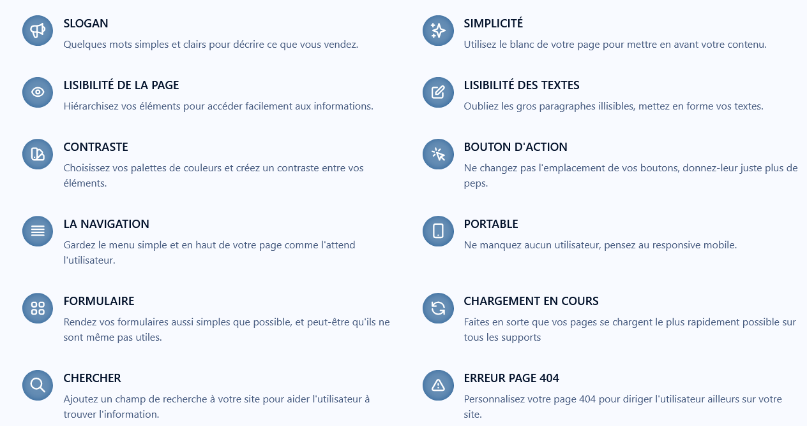

# Web érgonomie

*Ergonomie vient du grec ergon qui signifie travail et nomos qui signifie loi.*

Pour faire un parallèle avec la vie de tous les jours, lorsque vous serez assis dans votre canapé, l'accoudoir sera à la bonne hauteur, la profondeur d'assise sera à la bonne dimension et le coussin sera moelleux à souhait. Eh bien, c'est l'ergonomie.

## Liste des exemples d'érgonomie a savoir:

